<p align="center">
  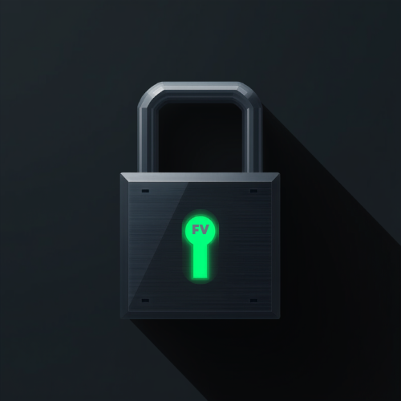
</p>

<h1 align="center">FortressVault</h1>

<p align="center">
  <strong>Zero‑knowledge, completely offline. Engineered with field‑level encryption and a decoy vault – security that refuses to compromise.</strong><br>
</p>

<p align="center">
  <a href="https://github.com/Ezzy401k/FortressVault/releases/latest">
    
  </a>
  <a href="LICENSE">
    
  </a>
  <a href="https://f-droid.org">
    
  </a>
</p>

---

## 🔐 Why FortressVault?

Most password managers encrypt an entire database with a single master key. If that key is compromised – through malware, memory scraping, or an unlocked device – everything is exposed.  
**FortressVault dramatically raises the bar.**

It uses **field‑level encryption**: every password, TOTP secret, and file is encrypted with its own randomly generated key. These keys are themselves wrapped by a master key that never leaves hardware‑backed storage. Even if an attacker captures the device while the vault is unlocked, they cannot decrypt one item from another.

On top of that, FortressVault operates **completely offline**, includes a **decoy vault** to mislead coercive attackers, and can check passwords against known breaches without ever sending data off the device.

| Traditional Managers | FortressVault |
|----------------------|--------------|
| Single-key database encryption | **Field‑level encryption** – every item has its own key |
| No built‑in coercion defence | **Decoy Vault** – hand over a dummy vault under duress |
| Cloud sync required for multi‑device | **Zero internet permission** – fully air‑gapped |
| Leak checks require internet | **Offline leak checker** – local Bloom filter, no data sent |
| Security depends on one master key | **Layered protection** – independent DEKs, hardware‑backed KEK, Argon2id derivation |

---

## 🔬 Cryptography & Open Source

FortressVault is **fully open source** (MIT License) – the entire cryptographic design is public and open for review.  
No independent security audit has been performed yet, but the architecture is documented and can be examined by anyone.

**Algorithms used:**

- **AES‑256‑GCM** for all symmetric encryption (passwords, files, TOTP secrets)
- **Argon2id** (64 MiB memory, 3 iterations, 4‑way parallelism) for key derivation from the master password
- **ECIES** (Elliptic Curve Integrated Encryption Scheme) on `secp256r1` for secure contact‑to‑contact sharing
- **BIP‑39** compatible 24‑word recovery phrase (using a custom hardening step)
- **PBKDF2‑HMAC‑SHA256** for decoy password derivation

All cryptographic keys are generated using `SecureRandom`, IVs are 96‑bit (12 bytes), and authentication tags are 128‑bit, following NIST recommendations.

---

## ✨ Features

### 🛡️ Defense in Depth

- **Field‑level encryption** – separate Data Encryption Key (DEK) for each entry
- **Argon2id** key derivation with strong parameters
- **Hardware‑backed Keystore** – master key stored in TEE / StrongBox
- **Biometric unlock** – key automatically invalidated after biometric enrollment changes
- **Progressive brute‑force lockout** – configurable delays, up to permanent lockout
- **Optional hardcore self‑destruct** – wipe the vault after 10 consecutive failures (24‑word recovery phrase ensures you’re never truly locked out)
- **Anti‑screenshot & anti‑clipboard capture** enforced globally
- **Memory safety** – all plaintext secrets are zeroed immediately after use

### 🧅 Anti‑Coercion

- **Decoy Vault** – a separate password opens a harmless dummy vault; the real vault stays hidden
  - All decoy data is actually encrypted with the decoy password, making it indistinguishable from a genuine vault
  - **Fake settings** within the decoy vault are saved inside the encrypted decoy database and persist across sessions, while the real settings remain untouched
- **Stealth in settings** – the Decoy Vault toggle behaves normally inside the decoy vault, never revealing that it’s a decoy session

### 🔑 Password Management

- Unlimited entries with optional expiry dates
- **Password generator** – adjustable length and character sets
- **Password history** and reuse warnings
- **Live TOTP codes** that can be linked to password entries
- Search and filter by type (All, Shared, Expiring)
- **Autofill service** for apps and browsers

### 📁 Encrypted Files

- Import any file – encrypted with its own key
- View or save after biometric confirmation
- Filter by file type (Images, Documents, Videos, Archives…)

### 📲 Offline Sharing (QR‑based)

- Share passwords and files with trusted contacts via QR codes
- **ECIES encryption** ensures only the intended recipient can decrypt
- Expiry dates on shared passwords
- **Pending import queue** – receive shared files even when the vault is locked

### 🧬 Recovery Phrase

- 24‑word mnemonic (BIP‑39 wordlist) backed by a verifiable setup process
- Unlock screen recovery – never get locked out of your data

### 🏥 Data Resilience

- **Defensive database handling** – if a database file becomes corrupted (e.g., due to a decryption error), the file is quarantined and replaced with a fresh vault, while the recovery phrase remains valid to restore previous data

---

## 🎨 Design & User Experience

FortressVault pairs its security foundation with a distinctive **tactical hardware aesthetic** – sharp rectangles, monospace fonts, and a cyberpunk‑inspired Matrix‑style dashboard.

- **Matrix‑rain health gauge** – a live visual indicator of vault integrity
- **Leaked / Weak / Reused / Expiring** counters with one‑tap filtering
- **Dark / light mode** with an animated circular reveal transition
- **Glass‑morphic navigation dock** with hardware accents
- Built‑in **User Guide** accessible from every screen

These visual elements are deliberately separated from the security architecture: they complement the tool without diluting its security‑critical messaging.

---

## 📸 Screenshots

<p align="center">
  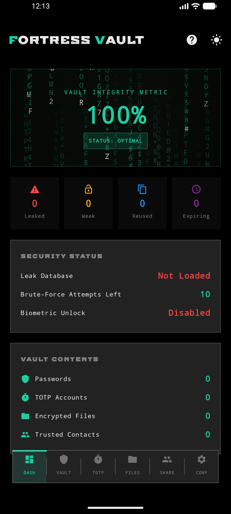
  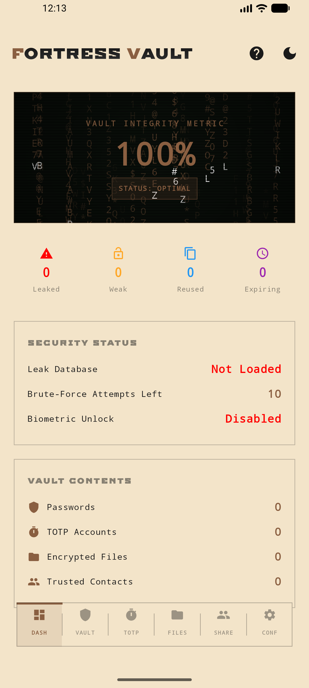
  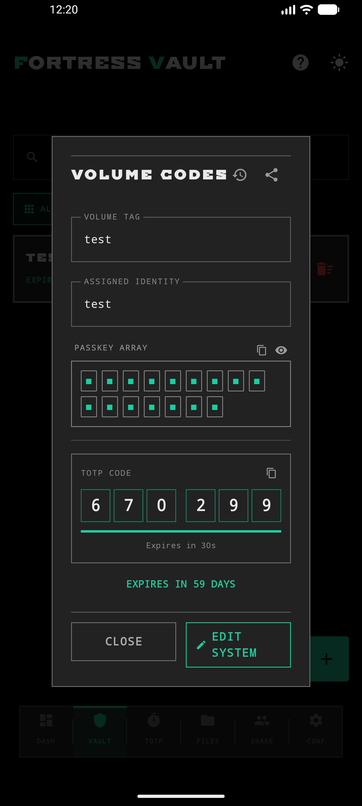
  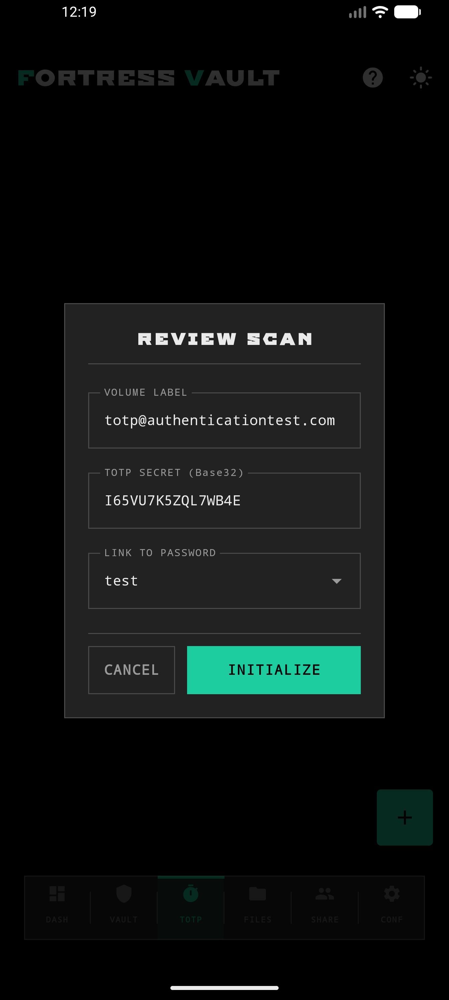
  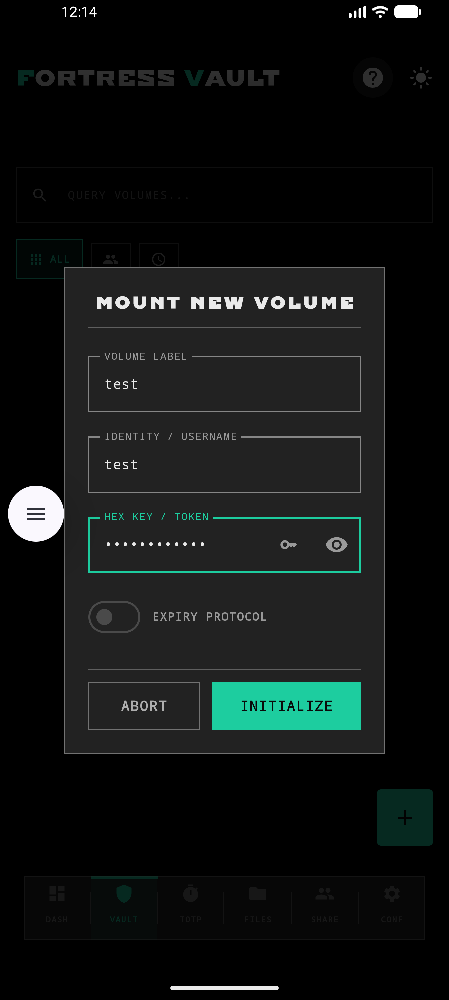
  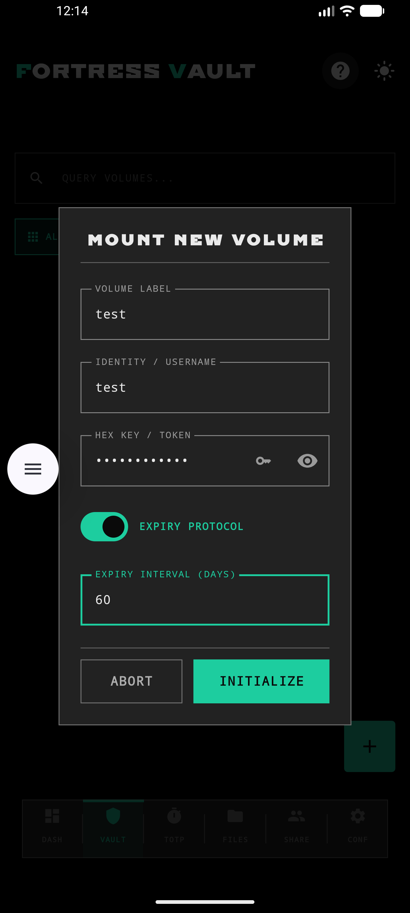
  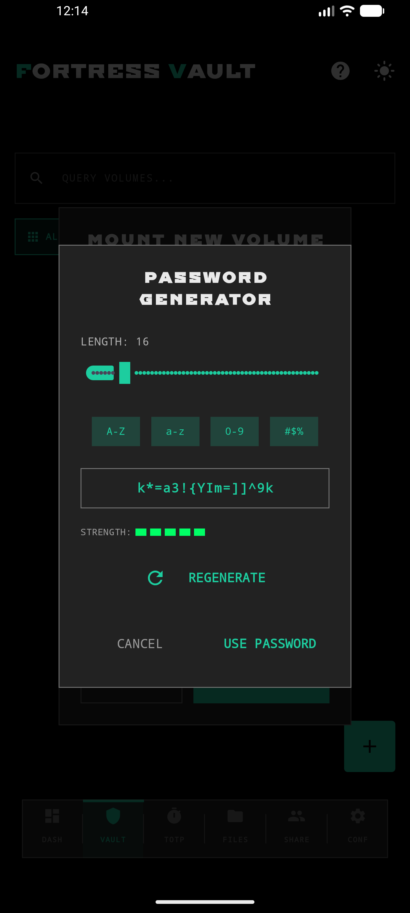
  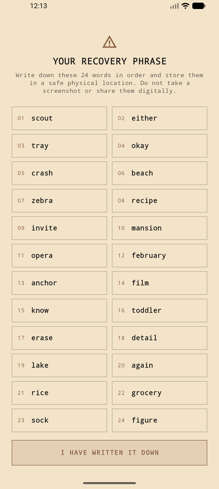
  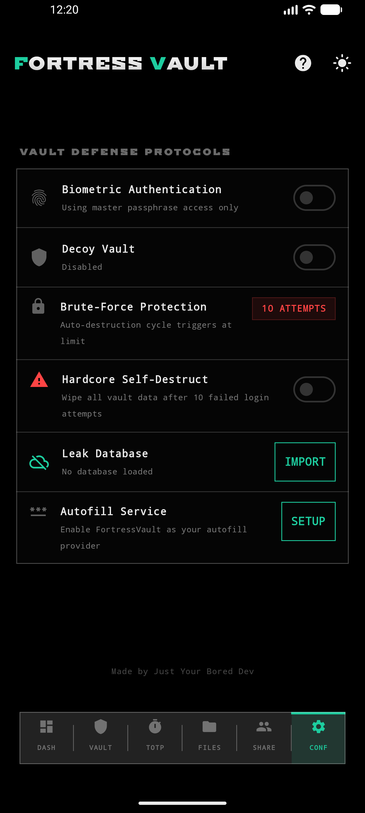
  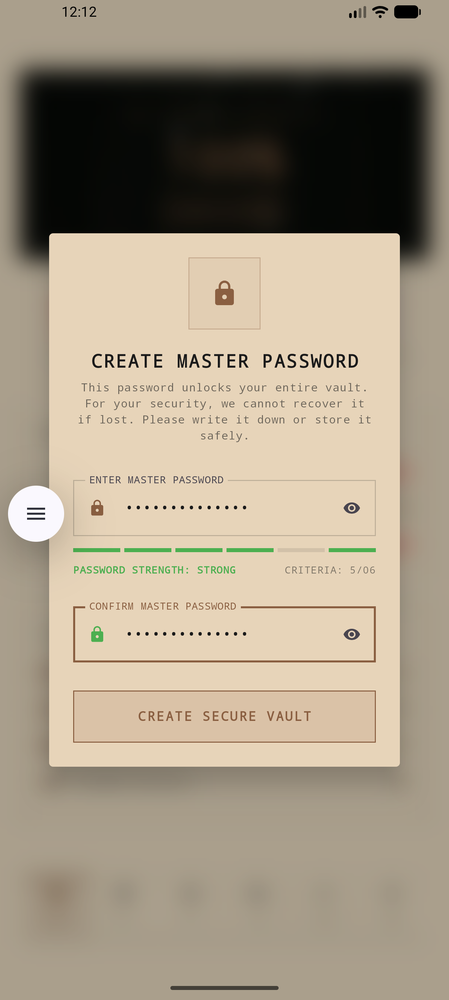
  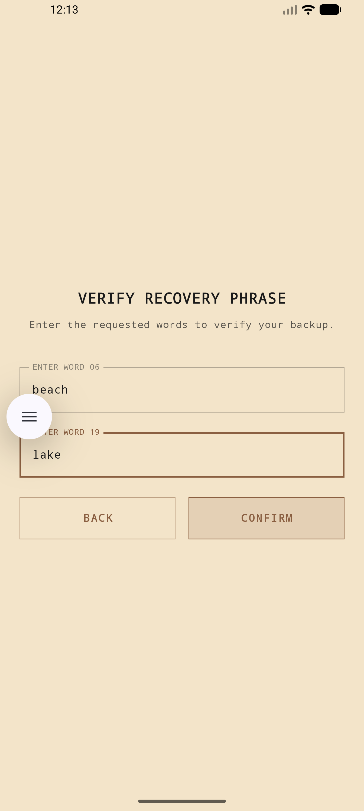
  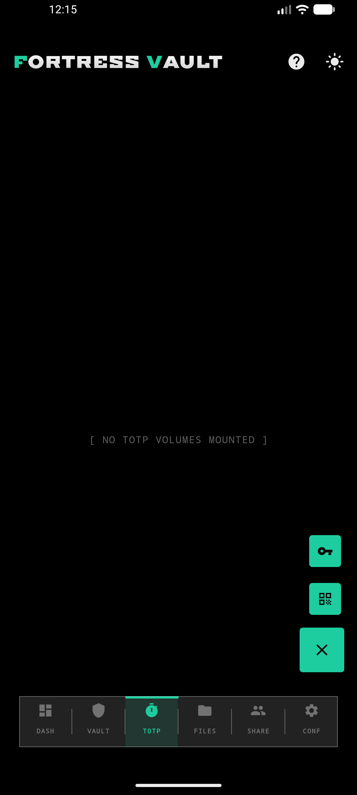
  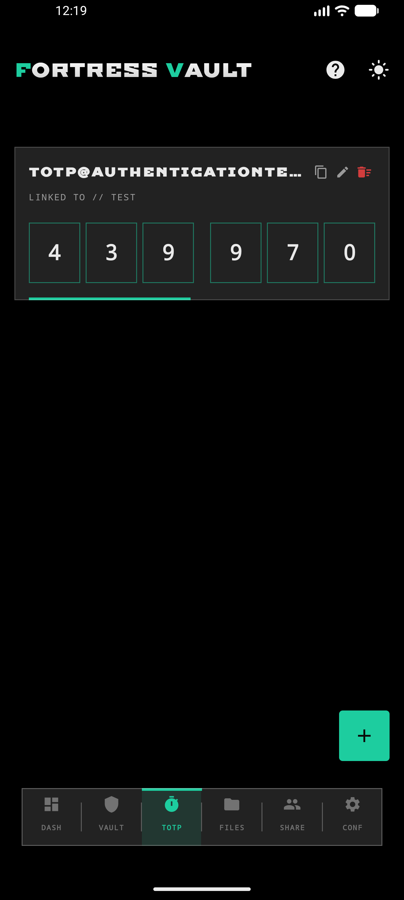
  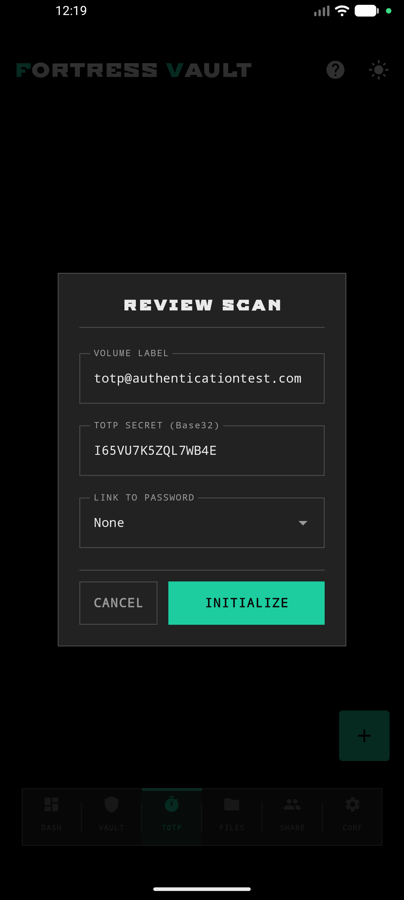
  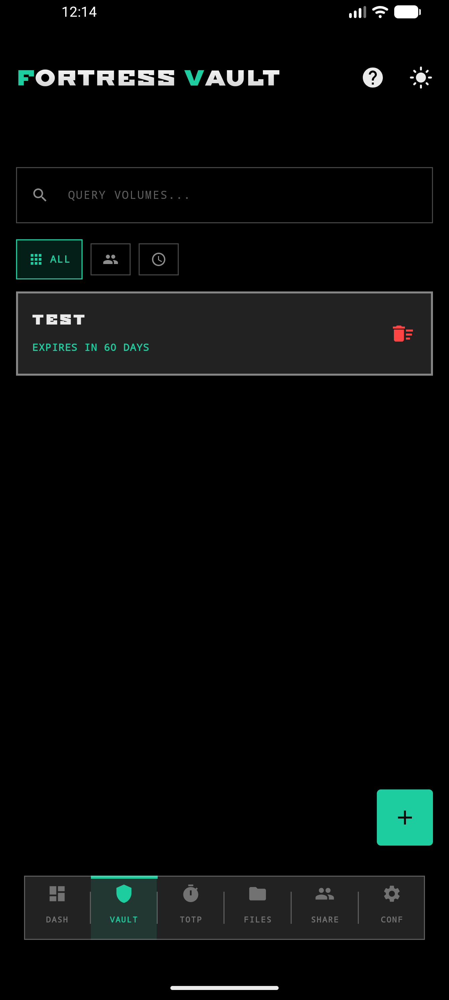
  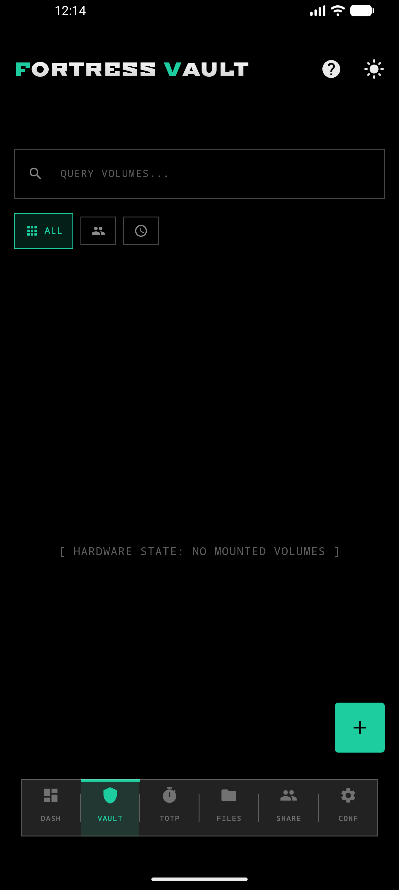
</p>

---

## 📥 Download & Install

### Option 1 – Download the APK (recommended)

1. Go to the [Releases page](https://github.com/Ezzy401k/FortressVault/releases/latest)
2. Download the `FortressVault-vX.X.X.apk` file
3. On your phone, enable “Install from unknown sources” for your browser or file manager
4. Install and verify the SHA‑256 checksum:

```
682b9c98c6f4b14a0bce20fbc8e317e81cb8e54697407142eff0cb875f93ca39
```

---

## 🏁 Final Note

FortressVault is not a cloud‑connected convenience tool. It is a **personal security instrument** built for users who need genuine data isolation, field‑level encryption, and a credible way to resist physical coercion. Its strongest selling points are offline‑first operation, independent per‑item keys, and the decoy vault. Everything else – from the Matrix dashboard to the glass dock – is built on top of that foundation, never in place of it.
