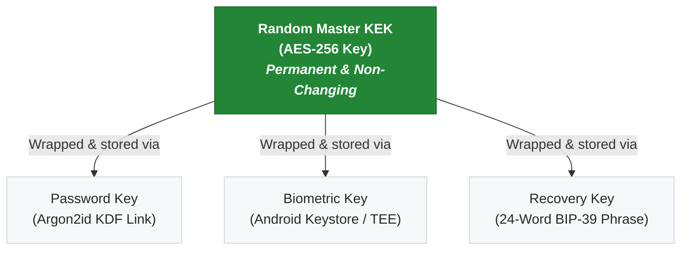
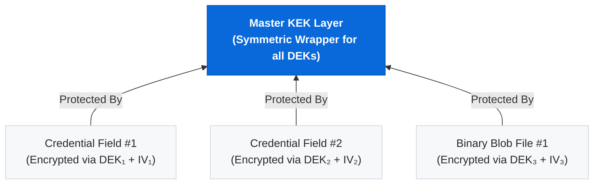

# Security Architecture of FortressVault

This document describes how FortressVault protects your data, what attacks it defends against, and what its structural limitations are.  
**Transparency is a core security feature.**

---

## 1. Zero‑Knowledge, Offline‑Only Design

* **No Network Footprint:** FortressVault does **not request the `INTERNET` permission**. The Android sandbox physically prevents the operating system from allowing it to transmit data outside the device boundary.
* **Local Processing:** All encryption transformations, key derivation processes, and decryption events happen exclusively within user-space on the hardware platform.
* **Complete Privacy Architecture:** No background tracking analytics, no telemetry data streams, and no crash reporting frameworks are embedded – **nothing ever leaves your phone**.

---

## 2. Master Key Encryption Key (KEK) Architecture



1. **Master KEK** – A cryptographically strong, random 256‑bit key generated at the exact initialization moment of the vault. It is responsible for transparently encrypting every SQL database on disk through an integrated SQLCipher Engine layer.
2. **Password Key** – Derived natively from your master password using the memory-hard **Argon2id** algorithm configured with specific parameters (64 MiB memory, 3 iterations, 4 parallel execution threads). The Master KEK is wrapped (AES-KeyWrapped) using this derived value and stored.
3. **Biometric Key** – Securely generated and isolated in the Android Keystore system infrastructure, bound directly to hardware elements like the Trusted Execution Environment (TEE) or StrongBox. It guards the master KEK behind a biometric hardware verification gate.
4. **Recovery Phrase Key** – Derived securely using a standard 24‑word BIP‑39 mnemonic scheme processed via `PBKDF2-HMAC-SHA512` utilizing 2,048 distinct iterative cycles. This serves as an emergency unwrapping protocol for recovery.

> 💡 **Security Engineering Optimization:** Changing your master password only updates the wrapping metadata of the permanent KEK. The underlying raw application databases are never re-encrypted directly, rendering user password resets instantaneous while ensuring zero structural write-stress to storage blocks.

---

## 3. Field‑Level Encryption (FLE)

To eliminate systemic cascading failures, every individual entry field item within a repository structure maintains a decoupled **Data Encryption Key (DEK)** mechanism:



* Each DEK consists of a uniquely seeded, secure random 256‑bit symmetric key.
* The raw field value plaintext payloads are processed through **AES‑256‑GCM** primitives using the localized DEK and a secure, non-repeating 12‑byte Initialization Vector (IV).
* The distinct DEK is itself encrypted by the top-tier Master KEK and stored inline with the encrypted cipher record blocks.
* If a specific key context is compromised, an attacker only yields access to **one exact field asset** rather than exposing the broader structured ecosystem.

---

## 4. Key Derivation Functions (KDF)

* **New Vault Formats:** Enforces Argon2id (64 MiB RAM allocation, 3 iterations, 4 parallelism factor). This memory-hard layout offers maximal resistance against multi-threaded GPU/ASIC accelerated brute-force setups.
* **Legacy Vault Formats:** Utilizes `PBKDF2-HMAC-SHA256` with 600,000 iterations. Legacy containers are implicitly transformed to the Argon2id schema during the initial successful login pipeline sequence.
* **Decoy Vault Profiles:** Employs a downgraded `PBKDF2-HMAC-SHA256` routine running exactly 100,000 iterations. This structural reduction is intentional, facilitating digital forensic profiling to discern it cleanly from standard operational vaults.

---

## 5. Biometric Unlock Integration

* The biometric keying material handles interactions deep within the isolated **Android Keystore system architecture**, hardware-isolated via an operational TEE ecosystem or a dedicated physical StrongBox module.
* Key configurations explicitly declare the flag `setUserAuthenticationRequired(true)`, which systematically locks key retrieval until verified cryptographically by biometric subsystems.
* The container binding is **immediately invalidated and destroyed** if a new biometric profile template fingerprint or face structure registration event occurs on the parent device environment.

---

## 6. Brute‑Force Mitigation Matrices

To resist interactive automated guessing attacks, a strict escalation control protocol limits ongoing failed authorization cycles:

| Failed Attempts Counter | Enforced Systemic Consequence |
| --- | --- |
| **1 – 3** | Zero lockout window; generic validation warning interface notification triggered. |
| **4** | Enforced 30-second localized programmatic interface freeze. |
| **5** | Enforced 5-minute access lockout phase. |
| **6** | Enforced 2-hour software lockdown phase. |
| **7** | Enforced 24-hour total validation freeze. |
| **8** | Enforced 3-day full authorization suspension. |
| **9** | Enforced 7-day extended authentication quarantine. |
| **10+** | Persistent looping 7-day lockdown cycle **OR** execution of instant system wipe protocols (if the specialized user option *"Hardcore Self‑Destruct"* is active). |

* Lockout enforcement engines track intervals relying exclusively upon `SystemClock.elapsedRealtime()` hardware clocks, bypassing local system time manipulation attempts.
* The error log counters are stored down in an isolated `EncryptedSharedPreferences` block, keeping root-level administrative file edits blocked.
* Following any warm system reboot event, outstanding timer states are evaluated and re-applied before system unlock mechanisms activate.

---

## 7. Decoy Vault Architecture (Anti‑Coercion Protection)

* Providing an alternative master password opens a fully sandboxed, physically distinct, and independent relational database engine located at `fortress_decoy.db`.
* The interface, UI loops, and operational layout present identically to the original interface structure, but pull mock record objects exclusively from dummy tables.
* Biometric entry pipelines are hardcoded to **never** index or reveal data structures bound to the Decoy environment.
* The intentional cryptographic decision to down-tier the decoy derivation routines to 100,000 PBKDF2 loops allows sophisticated forensic analyses to differentiate passwords without rendering the distinction obvious to a casual external observer during active coercion scenarios.

---

## 8. Offline Leak Checking Subsystem

* Users retain an option to securely import static, high-density Bloom filter data payloads directly parsed from the widespread *HaveIBeenPwned* dictionary.
* Analytic operations operate **completely offline**. Only the initial localized SHA-1 hashing matrix of a credential record undergoes inspection; information never transitions to external networks.
* The high-capacity lookup filter uses low-overhead memory-mapped file access frameworks (`MappedByteBuffer`) to run operations natively without causing typical memory footprint exhaustion from loading 800MB+ datasets into operating RAM.

---

## 9. Structured Data at Rest

* Databases are fully encapsulated using **SQLCipher** operating in **AES‑256‑CBC** configuration.
* The underlying operational layout splits concerns completely across four separate file spaces: `passwords`, `TOTP`, `files`, and `contacts`.
* The direct decryption password applied for database initialization tasks is the high-entropy random 256-bit Master KEK asset.
* All structural application partitions reside exclusively in application-private local sandbox filespace paths, preventing visibility from concurrent processing contexts on the host operating system.

---

## 10. Clipboard Protection Systems

* Upon copying cleartext password blocks or localized Time-Based One-Time Password (TOTP) items, the operating clipboard stack triggers a hard flush precisely **after 30 seconds**.
* This task sequence executes out of an isolated Android **Foreground Service**, ensuring execution continuity even if the primary host interface loop is forcefully optimized out or backgrounded by the kernel.

---

## 11. Anti‑Screenshot & Capture Mitigations

* Every single rendering component subclass systematically enforces window configuration properties using the `FLAG_SECURE` configuration token.
* The underlying windowing manager subroutines actively intercept and block external video recording engines, screenshot captures, and display generation within system task-switching interfaces.

---

## 12. Known Structural Limitations

* **Platform Exclusivity:** The ecosystem targets the Android mobile platform; no current native distributions exist for desktop or iOS environments.
* **Independent Auditing:** The engineering design layout and codebase have not yet been evaluated under a formal third-party external code assessment.
* **Shared Application Cryptographic Component:** A shared symmetric key arrangement is distributed inside the current APK releases for specific secure code-sharing modules. While isolated at rest via the user-specific password structure, a targeted reverse-engineering exploit of the application package structure could allow data visibility into shared QR code metadata blocks. *(Note: Authentic payload items remain fully wrapped using independent ECIES cryptography structures mapping explicitly to the verified recipient).*
* **Hardware Token Limitations:** Integrated token tracking configurations via NFC protocols or external YubiKey infrastructure components are features sitting on the active engineering development roadmap.

---

## 13. Vulnerability Disclosure Protocol

If you discover an exploitable defect or structural vulnerability, please **do not create a public issue report ticket**. Please coordinate discovery reporting directly via encrypted email targeting **esraelmekdem@gmail.com** enclosing the tracking facts:

* A precise, accurate technical breakdown of the suspected bug.
* Detailed steps required to reproduce the unexpected operational conditions reliably.
* The specific application deployment builds tested.
* Any architectural or patch mitigations you recommend.

Security reports are evaluated immediately. Initial triage confirmation occurs within **72 hours**. Verified flaws will be addressed with emergency engineering patches, and we will extend formal public attribution inside project changelogs (at the reporter's option).

---

## 14. Cryptographic Build Verification

Every formal release tag distributes an associated SHA-256 build checksum. To verify that your locally downloaded production application distribution cleanly matches the compiled open-source build repository format, run the following verification command in your terminal shell:

```bash
sha256sum FortressVault-vX.X.X.apk

```
